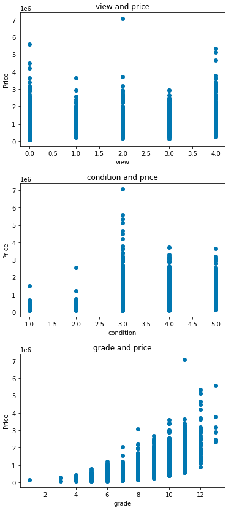

# 房價預測
## 1.房價預測使用工具：
### 使用的程式軟體：
Google Colaboratory  
### 使用的測試檔案：
  train-data.csv - 訓練的資料合集  
  valid-data.csv - 驗證的資料合集  
  test-data.csv - 測試的資料合集  
  metaData.csv - 介紹資料的 
## 2.程式方塊圖及作法：
  

## 3.畫圖及結果分析：
             

## 4.討論預測值誤差很大的狀況：
  一開始是以為model的隱藏層數不夠，後來發現這跟我們挑選訓練的data很有相關，
  在訓練時需要考慮到我們所訓練的data和我們所想要得到的目標關聯性產生良好的影響，
  並去斟酌選取必要的data作為訓練模型的資料基礎，再做模型的訓練，結果會比之前的預測誤差的狀況要好的多。
  
  在調整模型方面，除了在調整神經元參數、層數以外，還有額外加入earlystop的指令，
  可以防止模型在訓練時產生overfiting，進而讓模型產生更好的結果。
  
## 5.修正方案：
### (1).選取需要的data參數
  
  
### (2).改良訓練模型的參數、層數、優化器
  
### (3).加入earlystop的指令防止overfiting
  
